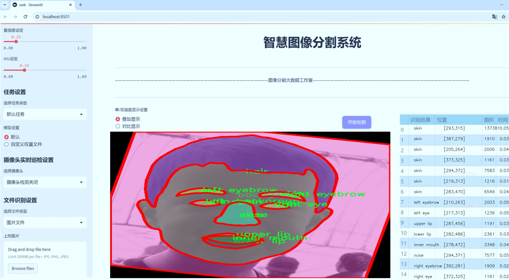
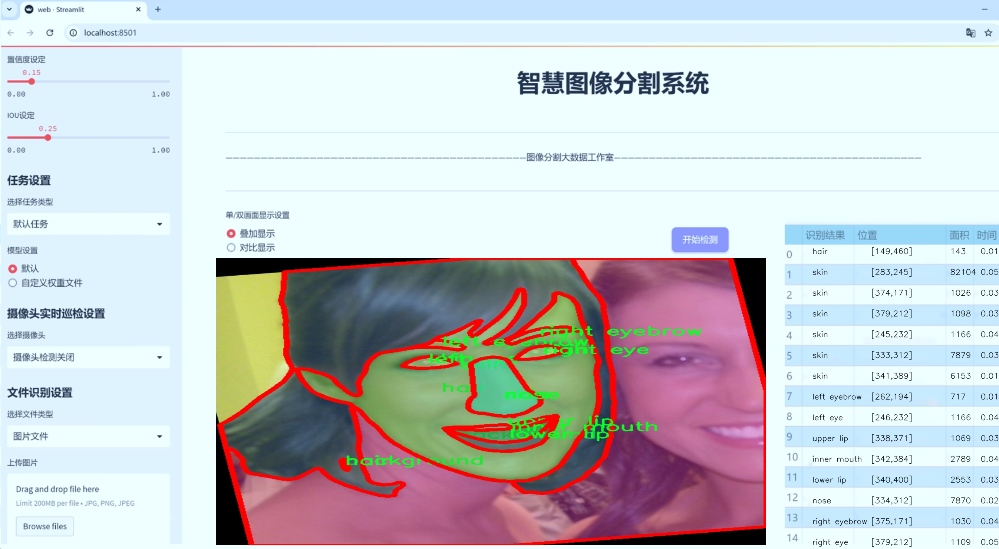
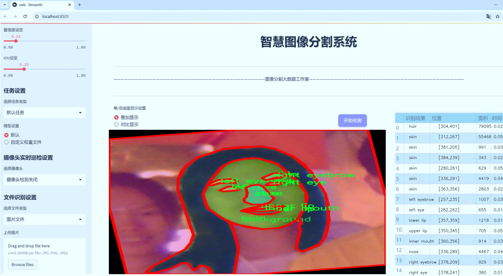
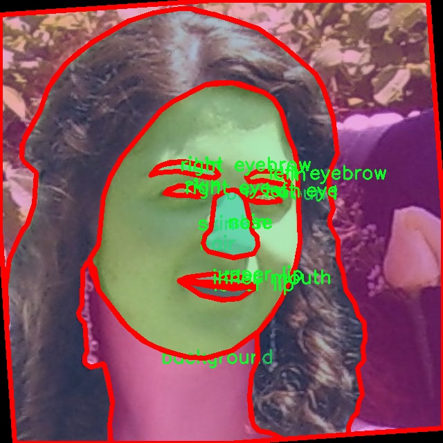
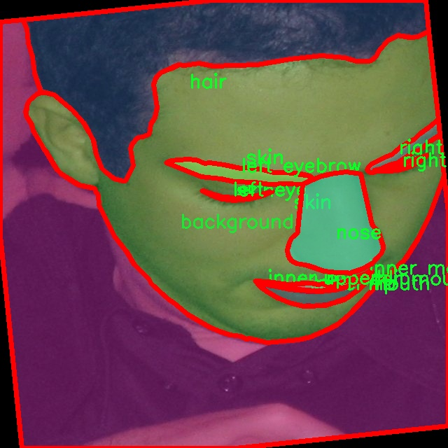
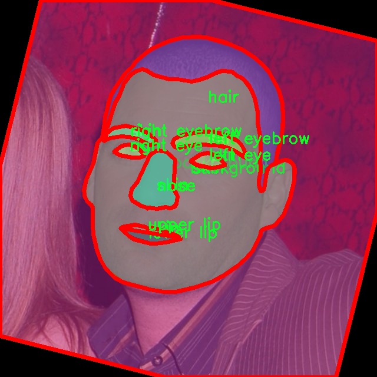
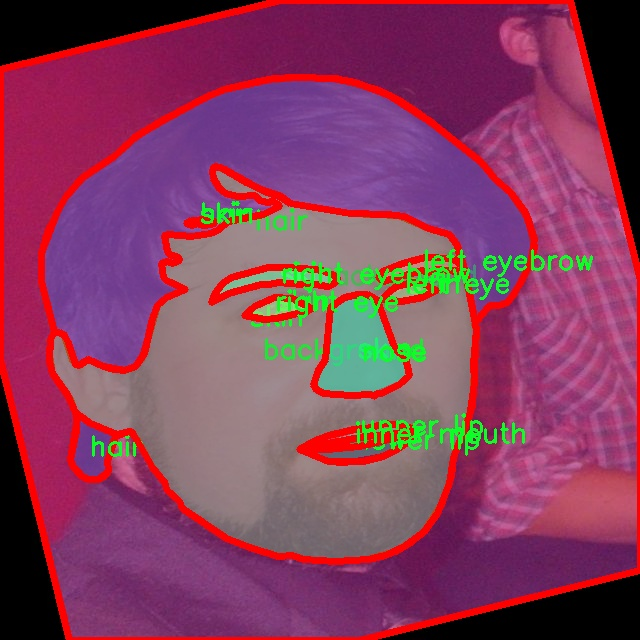
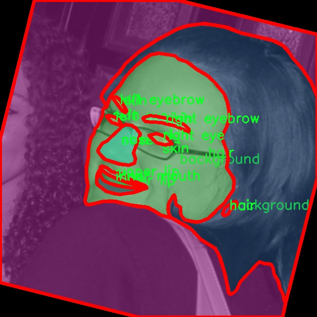

# 人脸特征图像分割系统： yolov8-seg-C2f-ODConv

### 1.研究背景与意义

[参考博客](https://gitee.com/YOLOv8_YOLOv11_Segmentation_Studio/projects)

[博客来源](https://kdocs.cn/l/cszuIiCKVNis)

研究背景与意义

随着人工智能技术的迅猛发展，计算机视觉领域在各个应用场景中扮演着越来越重要的角色。人脸识别与分析作为计算机视觉的一个重要分支，已经广泛应用于安防监控、智能家居、社交媒体等多个领域。尤其是在深度学习技术的推动下，基于卷积神经网络（CNN）的人脸特征提取和分割技术得到了显著提升。然而，现有的人脸特征分割方法在处理复杂背景、光照变化以及不同人脸姿态时，仍然面临诸多挑战。因此，研究一种高效、准确的人脸特征图像分割系统具有重要的理论价值和实际意义。

本研究旨在基于改进的YOLOv8模型，构建一个高效的人脸特征图像分割系统。YOLO（You Only Look Once）系列模型以其快速的检测速度和较高的准确率而受到广泛关注，尤其在实时应用场景中表现出色。YOLOv8作为该系列的最新版本，集成了多种先进的技术，具备更强的特征提取能力和更高的检测精度。通过对YOLOv8进行改进，结合人脸特征的具体需求，我们期望能够进一步提升其在复杂场景下的人脸特征分割性能。

在数据集方面，本研究将使用LaPa-COCO数据集，该数据集包含2000张图像，涵盖11个类别，包括背景、头发、内嘴、左右眼、左右眉、上下唇、鼻子和皮肤等。这些类别的划分为人脸特征的细致分割提供了丰富的标注信息，能够有效支持模型的训练与评估。通过对这些特征的精确分割，我们不仅可以实现对人脸的高效识别，还能为后续的人脸表情分析、身份验证等应用奠定基础。

此外，随着社会对隐私保护和数据安全的日益重视，如何在保证用户隐私的前提下进行人脸特征分析也成为了一个亟待解决的问题。本研究将探讨在特征分割过程中如何有效地处理数据隐私问题，确保在技术应用中遵循相关法律法规和伦理标准。这一探索不仅有助于推动人脸识别技术的健康发展，也为相关领域的研究提供了新的思路。

综上所述，基于改进YOLOv8的人脸特征图像分割系统的研究，不仅能够提升人脸特征分割的准确性和效率，还有助于推动计算机视觉技术在实际应用中的广泛应用。同时，研究将关注数据隐私保护问题，为人脸识别技术的可持续发展提供保障。通过本研究的深入探索，我们期望能够为人脸特征分析领域贡献新的理论与实践成果，推动相关技术的不断进步与创新。

### 2.图片演示







注意：本项目提供完整的训练源码数据集和训练教程,由于此博客编辑较早,暂不提供权重文件（best.pt）,需要按照6.训练教程进行训练后实现上图效果。

### 3.视频演示

[3.1 视频演示](https://www.bilibili.com/video/BV13MzbYBE8R/)

### 4.数据集信息

##### 4.1 数据集类别数＆类别名

nc: 11
names: ['background', 'hair', 'inner mouth', 'left eye', 'left eyebrow', 'lower lip', 'nose', 'right eye', 'right eyebrow', 'skin', 'upper lip']


##### 4.2 数据集信息简介

数据集信息展示

在本研究中，我们采用了名为“LaPa-COCO”的数据集，以支持改进YOLOv8-seg的人脸特征图像分割系统的训练和验证。LaPa-COCO数据集专门设计用于面部特征的精确分割，涵盖了多种人脸相关的细节特征，使其成为本项目的理想选择。该数据集的类别数量为11，具体包括：背景、头发、内嘴、左眼、左眉、下唇、鼻子、右眼、右眉、皮肤和上唇。这些类别的细致划分为模型的训练提供了丰富的标注信息，能够有效提升分割的准确性和细腻度。

首先，背景类别的存在为模型提供了一个重要的参考点，使其能够在复杂的场景中有效地识别和分离人脸特征。背景的多样性使得模型在训练过程中能够学习到如何在不同环境下进行特征提取，从而增强其在实际应用中的鲁棒性。其次，头发类别的标注使得模型能够识别和分割出不同发型的特征，这对于实现更加自然和真实的人脸重建至关重要。通过对头发的精确分割，模型能够更好地处理各种发型的变化，提升最终输出图像的真实感。

在面部特征方面，LaPa-COCO数据集提供了详细的标注，包括内嘴、左眼、左眉、下唇、鼻子、右眼、右眉、皮肤和上唇等多个细分类别。这些细致的分类不仅帮助模型理解人脸的结构，还能够提升对微小面部表情变化的敏感度。例如，左眼和右眼的分割能够使模型在进行表情识别时更加精准，而下唇和上唇的细致标注则为面部表情的动态变化提供了必要的支持。

此外，皮肤类别的标注为模型提供了关于肤色和肤质的重要信息，这对于人脸识别和重建过程中的色彩还原至关重要。通过对皮肤的精确分割，模型能够在生成合成图像时更好地再现真实肤色，从而提升最终结果的视觉效果。

总的来说，LaPa-COCO数据集的多样性和细致性为改进YOLOv8-seg的人脸特征图像分割系统提供了坚实的基础。通过对各个类别的精确标注，模型能够在训练过程中学习到丰富的特征信息，从而在实际应用中实现更高的分割精度和更好的性能表现。随着技术的不断进步，基于LaPa-COCO数据集的研究将为人脸识别、表情分析和相关领域的发展提供重要的支持，推动智能视觉系统的进一步创新与应用。











### 5.项目依赖环境部署教程（零基础手把手教学）

[5.1 环境部署教程链接（零基础手把手教学）](https://www.bilibili.com/video/BV1jG4Ve4E9t/?vd_source=bc9aec86d164b67a7004b996143742dc)


[5.2 安装Python虚拟环境创建和依赖库安装视频教程链接（零基础手把手教学）](https://www.bilibili.com/video/BV1nA4VeYEze/?vd_source=bc9aec86d164b67a7004b996143742dc)

### 6.手把手YOLOV8-seg训练视频教程（零基础手把手教学）

[6.1 手把手YOLOV8-seg训练视频教程（零基础小白有手就能学会）](https://www.bilibili.com/video/BV1cA4VeYETe/?vd_source=bc9aec86d164b67a7004b996143742dc)


按照上面的训练视频教程链接加载项目提供的数据集，运行train.py即可开始训练



     Epoch   gpu_mem       box       obj       cls    labels  img_size
     1/200     0G   0.01576   0.01955  0.007536        22      1280: 100%|██████████| 849/849 [14:42<00:00,  1.04s/it]
               Class     Images     Labels          P          R     mAP@.5 mAP@.5:.95: 100%|██████████| 213/213 [01:14<00:00,  2.87it/s]
                 all       3395      17314      0.994      0.957      0.0957      0.0843

     Epoch   gpu_mem       box       obj       cls    labels  img_size
     2/200     0G   0.01578   0.01923  0.007006        22      1280: 100%|██████████| 849/849 [14:44<00:00,  1.04s/it]
               Class     Images     Labels          P          R     mAP@.5 mAP@.5:.95: 100%|██████████| 213/213 [01:12<00:00,  2.95it/s]
                 all       3395      17314      0.996      0.956      0.0957      0.0845

     Epoch   gpu_mem       box       obj       cls    labels  img_size
     3/200     0G   0.01561    0.0191  0.006895        27      1280: 100%|██████████| 849/849 [10:56<00:00,  1.29it/s]
               Class     Images     Labels          P          R     mAP@.5 mAP@.5:.95: 100%|███████   | 187/213 [00:52<00:00,  4.04it/s]
                 all       3395      17314      0.996      0.957      0.0957      0.0845


### 7.50+种全套YOLOV8-seg创新点加载调参实验视频教程（一键加载写好的改进模型的配置文件）

[7.1 50+种全套YOLOV8-seg创新点加载调参实验视频教程（一键加载写好的改进模型的配置文件）](https://www.bilibili.com/video/BV1Hw4VePEXv/?vd_source=bc9aec86d164b67a7004b996143742dc)

### YOLOV8-seg算法简介

原始YOLOv8-seg算法原理

YOLOv8-seg作为YOLO系列的最新成员，结合了目标检测与语义分割的功能，展现出在精度与速度上的显著提升。该算法的设计旨在满足现代计算机视觉任务中对实时性和准确性的双重需求。YOLOv8-seg不仅延续了YOLO系列一贯的高效性，还在模型架构和训练策略上进行了创新，形成了一个适应多种应用场景的强大工具。

首先，YOLOv8-seg的网络结构可以分为四个主要部分：输入端、骨干网络、颈部网络和头部网络。输入端负责数据的预处理，包括马赛克数据增强、自适应锚框计算和自适应灰度填充。这些技术的应用不仅提高了模型的鲁棒性，还有效地扩展了训练数据的多样性，使得模型在面对不同场景时能够更好地适应。

在骨干网络部分，YOLOv8-seg采用了C2f模块和SPPF结构。C2f模块是YOLOv8的核心创新之一，其设计灵感来源于YOLOv7的ELAN结构，通过引入更多的分支和跨层连接，增强了特征学习的能力。这种设计使得模型在特征提取过程中能够保持丰富的梯度流，从而提高了特征表示的能力。SPPF结构则通过空间金字塔池化技术，有效地提取不同尺度的特征，减少了模型的参数量和计算量，同时提升了特征提取的效率。

颈部网络采用了路径聚合网络（PAN）结构，旨在增强对不同缩放尺度对象的特征融合能力。PAN通过多层特征的聚合，确保了模型在处理复杂场景时能够有效整合来自不同层次的信息，从而提升了检测的准确性和分割的精度。与传统的特征金字塔网络相比，PAN在特征融合的过程中更具灵活性，能够更好地适应多样化的输入数据。

在头部网络中，YOLOv8-seg采用了分类和检测过程的解耦设计。这一创新的结构将目标检测和语义分割的任务分开处理，使得模型在训练和推理过程中能够更专注于各自的目标。具体而言，分类分支使用了二元交叉熵损失（BCELoss），而回归分支则结合了分布焦点损失（DFLoss）和完全交并比损失函数（CIOULoss），从而在边界框预测和分割精度上实现了更高的准确性。

YOLOv8-seg的另一个重要创新是其无锚框（Anchor-Free）检测头的引入。这一设计减少了锚框的数量，简化了模型的预测过程，从而加速了非最大抑制（NMS）过程。这种无锚框的策略使得模型在面对复杂场景时，能够更快速地定位目标，同时提高了检测的精度。

在训练过程中，YOLOv8-seg采用了动态的Task-Aligned Assigner样本分配策略，能够根据分类与回归的分数加权结果选择正样本。这一策略的引入，进一步优化了模型的训练效率，使得YOLOv8-seg在处理不同任务时，能够灵活调整样本的分配，确保了模型在各类数据集上的表现。

总的来说，YOLOv8-seg在设计上充分考虑了实时性与准确性的平衡，通过引入多种创新技术，使得其在目标检测与语义分割任务中均表现出色。无论是在工业检测、自动驾驶还是智能监控等应用场景中，YOLOv8-seg都展现出了其强大的适应能力和卓越的性能。随着YOLOv8-seg的不断发展与完善，未来的计算机视觉任务将更加高效与智能。


### 9.系统功能展示（检测对象为举例，实际内容以本项目数据集为准）

图9.1.系统支持检测结果表格显示

  图9.2.系统支持置信度和IOU阈值手动调节

  图9.3.系统支持自定义加载权重文件best.pt(需要你通过步骤5中训练获得)

  图9.4.系统支持摄像头实时识别

  图9.5.系统支持图片识别

  图9.6.系统支持视频识别

  图9.7.系统支持识别结果文件自动保存

  图9.8.系统支持Excel导出检测结果数据


### 10.50+种全套YOLOV8-seg创新点原理讲解（非科班也可以轻松写刊发刊，V11版本正在科研待更新）

#### 10.1 由于篇幅限制，每个创新点的具体原理讲解就不一一展开，具体见下列网址中的创新点对应子项目的技术原理博客网址【Blog】：


[10.1 50+种全套YOLOV8-seg创新点原理讲解链接](https://gitee.com/qunmasj/good)

#### 10.2 部分改进模块原理讲解(完整的改进原理见上图和技术博客链接)【如果此小节的图加载失败可以通过CSDN或者Github搜索该博客的标题访问原始博客，原始博客图片显示正常】

### YOLOv8简介
YOLOv8是一种目标检测模型，是基于YOLO (You Only Look Once)系列算法发展而来的最新版本。它的核心思想是将目标检测任务转化为一个回归问题，通过单次前向传播即可直接预测出图像中的多个目标的位置和类别。
YOLOv8的网络结构采用了Darknet作为其主干网络，主要由卷积层和池化层构成。与之前的版本相比，YOLOv8在网络结构上进行了改进，引入了更多的卷积层和残差模块，以提高模型的准确性和鲁棒性。
YOLOv8采用了一种特征金字塔网络(Feature Pyramid Network,FPN)的结构，通过在不同层级上融合多尺度的特征信息，可以对不同尺度的目标进行有效的检测。此外，YOLOv8还引入了一种自适应感知域(Adaptive Anchors
的机制，通过自适应地学习目标的尺度和
长宽比，提高了模型对于不同尺度和形状目标的检测效果。
总体来说，YOLOv8结构模型综合了多个先进的目标检测技术，在保证检测速度的同时提升了检测精度和鲁棒性，被广泛应用于实时目标检测任务中。


#### yolov8网络模型结构图

YOLOv8 (You Only Look Once version 8)是一种目标检测算法，它在实时场景下可以快速准确地检测图像中的目标。
YOLOv8的网络模型结构基于Darknet框架，由一系列卷积层、池化层和全连接层组成。主要包含以下几个组件:
1.输入层:接收输入图像。
2.卷积层:使用不同尺寸的卷积核来提取图像特征。
3.残差块(Residual blocks):通过使用跳跃连接(skip connections）来解决梯度消失问题，使得网络更容易训练。
4.上采样层(Upsample layers):通过插值操作将特征图的尺寸放大，以便在不同尺度上进行目标检测。
5.池化层:用于减小特征图的尺寸，同时保留重要的特征。
6.1x1卷积层:用于降低通道数，减少网络参数量。
7.3x3卷积层:用于进—步提取和组合特征。
8.全连接层:用于最后的目标分类和定位。
YOLOv8的网络结构采用了多个不同尺度的特征图来检测不同大小的目标，从而提高了目标检测的准确性和多尺度性能。
请注意，YOLOv8网络模型结构图的具体细节可能因YOLO版本和实现方式而有所不同。


#### yolov8模型结构
YOLOv8模型是一种目标检测模型，其结构是基于YOLOv3模型进行改进的。模型结构可以分为主干网络和检测头两个部分。
主干网络是一种由Darknet-53构成的卷积神经网络。Darknet-53是一个经过多层卷积和残差连接构建起来的深度神经网络。它能够提取图像的特征信息，并将这些信息传递给检测头。
检测头是YOLOv8的关键部分，它负责在图像中定位和识别目标。检测头由一系列卷积层和全连接层组成。在每个检测头中，会生成一组锚框，并针对每个锚框预测目标的类别和位置信息。
YOLOv8模型使用了预训练的权重，其中在COCO数据集上进行了训练。这意味着该模型已经通过大规模数据集的学习，具有一定的目标检测能力。

### RT-DETR骨干网络HGNetv2简介
#### RT-DETR横空出世
前几天被百度的RT-DETR刷屏，参考该博客提出的目标检测新范式对原始DETR的网络结构进行了调整和优化，以提高计算速度和减小模型大小。这包括使用更轻量级的基础网络和调整Transformer结构。并且，摒弃了nms处理的detr结构与传统的物体检测方法相比，不仅训练是端到端的，检测也能端到端，这意味着整个网络在训练过程中一起进行优化，推理过程不需要昂贵的后处理代价，这有助于提高模型的泛化能力和性能。


当然，人们对RT-DETR之所以产生浓厚的兴趣，我觉得大概率还是对YOLO系列审美疲劳了，就算是出到了YOLO10086，我还是只想用YOLOv5和YOLOv7的框架来魔改做业务。。

#### 初识HGNet
看到RT-DETR的性能指标，发现指标最好的两个模型backbone都是用的HGNetv2，毫无疑问，和当时的picodet一样，骨干都是使用百度自家的网络。初识HGNet的时候，当时是参加了第四届百度网盘图像处理大赛，文档图像方向识别专题赛道，简单来说，就是使用分类网络对一些文档截图或者图片进行方向角度分类。


当时的方案并没有那么快定型，通常是打榜过程发现哪个网络性能好就使用哪个网络做魔改，而且木有显卡，只能蹭Ai Studio的平台，不过v100一天8小时的实验时间有点短，这也注定了大模型用不了。 

流水的模型，铁打的炼丹人，最后发现HGNet-tiny各方面指标都很符合我们的预期，后面就一直围绕它魔改。当然，比赛打榜是目的，学习才是享受过程，当时看到效果还可以，便开始折腾起了HGNet的网络架构，我们可以看到，PP-HGNet 针对 GPU 设备，对目前 GPU 友好的网络做了分析和归纳，尽可能多的使用 3x3 标准卷积（计算密度最高），PP-HGNet是由多个HG-Block组成，细节如下：


ConvBNAct是啥？简单聊一聊，就是Conv+BN+Act，CV Man应该最熟悉不过了：
```python
class ConvBNAct(TheseusLayer):
    def __init__(self,
                 in_channels,
                 out_channels,
                 kernel_size,
                 stride,
                 groups=1,
                 use_act=True):
        super().__init__()
        self.use_act = use_act
        self.conv = Conv2D(
            in_channels,
            out_channels,
            kernel_size,
            stride,
            padding=(kernel_size - 1) // 2,
            groups=groups,
            bias_attr=False)
        self.bn = BatchNorm2D(
            out_channels,
            weight_attr=ParamAttr(regularizer=L2Decay(0.0)),
            bias_attr=ParamAttr(regularizer=L2Decay(0.0)))
        if self.use_act:
            self.act = ReLU()
 
    def forward(self, x):
        x = self.conv(x)
        x = self.bn(x)
        if self.use_act:
            x = self.act(x)
        return x 
```
且标准卷积的数量随层数深度增加而增多，从而得到一个有利于 GPU 推理的骨干网络，同样速度下，精度也超越其他 CNN ，性价比也优于ViT-base模型。


另外，我们可以看到：

PP-HGNet 的第一层由channel为96的Stem模块构成，目的是为了减少参数量和计算量。PP-HGNet

Tiny的整体结构由四个HG Stage构成，而每个HG Stage主要由包含大量标准卷积的HG Block构成。

PP-HGNet的第三到第五层使用了使用了可学习的下采样层（LDS Layer），该层group为输入通道数，可达到降参降计算量的作用，且Tiny模型仅包含三个LDS Layer，并不会对GPU的利用率造成较大影响.

PP-HGNet的激活函数为Relu，常数级操作可保证该模型在硬件上的推理速度。

### 11.项目核心源码讲解（再也不用担心看不懂代码逻辑）

#### 11.1 ultralytics\solutions\object_counter.py

以下是经过精简和注释的核心代码部分，主要保留了 `ObjectCounter` 类及其关键方法，并添加了详细的中文注释：

```python
# 导入必要的库
from collections import defaultdict
import cv2
from shapely.geometry import Polygon
from shapely.geometry.point import Point
from ultralytics.utils.plotting import Annotator, colors

class ObjectCounter:
    """用于实时视频流中基于轨迹计数对象的类。"""

    def __init__(self):
        """初始化计数器，设置默认值。"""
        # 鼠标事件相关
        self.is_drawing = False  # 是否正在绘制
        self.selected_point = None  # 选中的点

        # 区域信息
        self.reg_pts = None  # 计数区域的点
        self.counting_region = None  # 计数区域的多边形
        self.region_color = (255, 255, 255)  # 区域颜色

        # 图像和注释信息
        self.im0 = None  # 当前帧图像
        self.annotator = None  # 注释器
        self.names = None  # 类别名称

        # 对象计数信息
        self.in_counts = 0  # 进入计数
        self.out_counts = 0  # 离开计数
        self.counting_list = []  # 计数列表

        # 轨迹信息
        self.track_history = defaultdict(list)  # 轨迹历史
        self.track_thickness = 2  # 轨迹线宽
        self.draw_tracks = False  # 是否绘制轨迹

    def set_args(self, classes_names, reg_pts, region_color=None, line_thickness=2, track_thickness=2, view_img=False, draw_tracks=False):
        """
        配置计数器的参数，包括类别名称、区域点和其他绘制设置。

        Args:
            classes_names (dict): 类别名称字典
            reg_pts (list): 定义计数区域的点
            region_color (tuple): 区域线的颜色
            line_thickness (int): 边框线的厚度
            track_thickness (int): 轨迹线的厚度
            view_img (bool): 是否显示视频流
            draw_tracks (bool): 是否绘制轨迹
        """
        self.reg_pts = reg_pts  # 设置区域点
        self.counting_region = Polygon(self.reg_pts)  # 创建计数区域多边形
        self.names = classes_names  # 设置类别名称
        self.region_color = region_color if region_color else self.region_color  # 设置区域颜色
        self.tf = line_thickness  # 设置线宽
        self.view_img = view_img  # 设置是否显示图像
        self.track_thickness = track_thickness  # 设置轨迹线宽
        self.draw_tracks = draw_tracks  # 设置是否绘制轨迹

    def extract_and_process_tracks(self, tracks):
        """
        提取并处理轨迹，更新计数和绘制结果。

        Args:
            tracks (list): 从对象跟踪过程中获得的轨迹列表。
        """
        boxes = tracks[0].boxes.xyxy.cpu()  # 获取边界框
        clss = tracks[0].boxes.cls.cpu().tolist()  # 获取类别
        track_ids = tracks[0].boxes.id.int().cpu().tolist()  # 获取轨迹ID

        self.annotator = Annotator(self.im0, self.tf, self.names)  # 初始化注释器
        self.annotator.draw_region(reg_pts=self.reg_pts, color=(0, 255, 0))  # 绘制计数区域

        for box, track_id, cls in zip(boxes, track_ids, clss):
            self.annotator.box_label(box, label=self.names[cls], color=colors(int(cls), True))  # 绘制边界框

            # 更新轨迹
            track_line = self.track_history[track_id]
            track_line.append((float((box[0] + box[2]) / 2), float((box[1] + box[3]) / 2)))  # 添加中心点
            track_line.pop(0) if len(track_line) > 30 else None  # 限制轨迹长度

            if self.draw_tracks:
                self.annotator.draw_centroid_and_tracks(track_line, color=(0, 255, 0), track_thickness=self.track_thickness)  # 绘制轨迹

            # 计数对象
            if self.counting_region.contains(Point(track_line[-1])):  # 检查中心点是否在计数区域内
                if track_id not in self.counting_list:  # 如果该ID未计数
                    self.counting_list.append(track_id)  # 添加到计数列表
                    if box[0] < self.counting_region.centroid.x:  # 判断方向
                        self.out_counts += 1  # 离开计数
                    else:
                        self.in_counts += 1  # 进入计数

        if self.view_img:  # 如果需要显示图像
            incount_label = 'InCount : ' + f'{self.in_counts}'  # 进入计数标签
            outcount_label = 'OutCount : ' + f'{self.out_counts}'  # 离开计数标签
            self.annotator.count_labels(in_count=incount_label, out_count=outcount_label)  # 显示计数标签
            cv2.imshow('Ultralytics YOLOv8 Object Counter', self.im0)  # 显示图像
            if cv2.waitKey(1) & 0xFF == ord('q'):  # 按'q'退出
                return

    def start_counting(self, im0, tracks):
        """
        启动对象计数过程。

        Args:
            im0 (ndarray): 当前视频流的帧图像。
            tracks (list): 从对象跟踪过程中获得的轨迹列表。
        """
        self.im0 = im0  # 存储当前图像
        if tracks[0].boxes.id is None:  # 如果没有轨迹ID，返回
            return
        self.extract_and_process_tracks(tracks)  # 提取并处理轨迹

if __name__ == '__main__':
    ObjectCounter()  # 创建对象计数器实例
```

### 代码核心部分分析：
1. **类的初始化**：`__init__` 方法中定义了对象计数器的基本属性，包括鼠标事件、区域信息、图像信息和计数信息。
2. **参数设置**：`set_args` 方法用于配置计数器的参数，如类别名称、区域点、颜色和线宽等。
3. **轨迹处理**：`extract_and_process_tracks` 方法提取轨迹信息，更新计数，并绘制边界框和轨迹。
4. **计数逻辑**：通过判断物体的中心点是否在计数区域内来进行计数，并根据物体的移动方向更新进入和离开的计数。
5. **显示图像**：在 `start_counting` 方法中显示当前帧图像，并处理轨迹数据。

这段代码实现了一个基本的对象计数器，能够在实时视频流中跟踪和计数物体。

这个文件定义了一个名为 `ObjectCounter` 的类，主要用于在实时视频流中基于物体的轨迹进行计数。类的功能包括初始化计数器、设置计数区域、处理鼠标事件、提取和处理物体轨迹，以及开始计数等。

在初始化方法 `__init__` 中，类的各种参数被设置为默认值，包括鼠标事件的状态、计数区域的信息、图像和注释的信息、物体计数的信息、轨迹信息等。具体来说，`is_drawing` 用于指示是否正在绘制，`selected_point` 用于存储当前选中的点，`reg_pts` 和 `counting_region` 用于定义计数区域，`in_counts` 和 `out_counts` 用于记录进入和离开的物体数量。

`set_args` 方法用于配置计数器的参数，包括类名、计数区域的点、区域颜色、线条厚度等。这个方法为后续的计数操作提供了必要的参数设置。

`mouse_event_for_region` 方法用于处理鼠标事件，使用户能够通过鼠标在视频流中动态调整计数区域。当用户按下鼠标左键时，如果点击了计数区域的某个点，则可以开始拖动该点；在鼠标移动时，更新该点的位置；松开鼠标左键时，停止拖动。

`extract_and_process_tracks` 方法用于提取和处理物体的轨迹。它从输入的轨迹数据中获取边界框、类别和轨迹ID，并使用 `Annotator` 类进行注释和绘制。该方法还负责计算物体的进入和离开数量，通过判断物体的中心点是否在计数区域内来实现。如果物体的中心点在计数区域内且之前未被计数，则根据物体的位置更新进入或离开的计数。

`start_counting` 方法是计数过程的主函数，它接收当前帧图像和物体轨迹作为输入，并调用 `extract_and_process_tracks` 方法进行处理。

最后，文件的末尾包含了一个主程序部分，实例化了 `ObjectCounter` 类，但并没有启动任何计数过程，通常这部分代码会在实际应用中被调用以启动计数器。

整体来看，这个类的设计使得用户能够灵活地在视频流中定义计数区域，并实时跟踪和计数进入和离开该区域的物体。

#### 11.2 ultralytics\nn\extra_modules\kernel_warehouse.py

以下是代码中最核心的部分，并附上详细的中文注释：

```python
import torch
import torch.nn as nn
import torch.nn.functional as F

class Attention(nn.Module):
    def __init__(self, in_planes, reduction, num_static_cell, num_local_mixture, norm_layer=nn.BatchNorm1d,
                 cell_num_ratio=1.0, nonlocal_basis_ratio=1.0, start_cell_idx=None):
        super(Attention, self).__init__()
        # 计算隐藏层的通道数
        hidden_planes = max(int(in_planes * reduction), 16)
        self.kw_planes_per_mixture = num_static_cell + 1  # 每个混合物的通道数
        self.num_local_mixture = num_local_mixture  # 本地混合物的数量
        self.kw_planes = self.kw_planes_per_mixture * num_local_mixture  # 总的通道数

        # 计算本地和非本地单元的数量
        self.num_local_cell = int(cell_num_ratio * num_local_mixture)
        self.num_nonlocal_cell = num_static_cell - self.num_local_cell
        self.start_cell_idx = start_cell_idx

        # 定义网络层
        self.avgpool = nn.AdaptiveAvgPool1d(1)  # 自适应平均池化
        self.fc1 = nn.Linear(in_planes, hidden_planes, bias=(norm_layer is not nn.BatchNorm1d))  # 全连接层
        self.norm1 = norm_layer(hidden_planes)  # 归一化层
        self.act1 = nn.ReLU(inplace=True)  # 激活函数

        # 根据非本地基数比率选择不同的映射方式
        if nonlocal_basis_ratio >= 1.0:
            self.map_to_cell = nn.Identity()  # 直接映射
            self.fc2 = nn.Linear(hidden_planes, self.kw_planes, bias=True)  # 第二个全连接层
        else:
            self.map_to_cell = self.map_to_cell_basis  # 使用基于映射
            self.num_basis = max(int(self.num_nonlocal_cell * nonlocal_basis_ratio), 16)  # 基础数量
            self.fc2 = nn.Linear(hidden_planes, (self.num_local_cell + self.num_basis + 1) * num_local_mixture, bias=False)
            self.fc3 = nn.Linear(self.num_basis, self.num_nonlocal_cell, bias=False)  # 用于非本地映射的全连接层
            self.basis_bias = nn.Parameter(torch.zeros([self.kw_planes]), requires_grad=True).float()  # 基础偏置

        self.temp_bias = torch.zeros([self.kw_planes], requires_grad=False).float()  # 温度偏置
        self.temp_value = 0  # 温度值
        self._initialize_weights()  # 初始化权重

    def _initialize_weights(self):
        # 初始化网络中的权重
        for m in self.modules():
            if isinstance(m, nn.Linear):
                nn.init.kaiming_normal_(m.weight, mode='fan_out', nonlinearity='relu')  # Kaiming初始化
                if m.bias is not None:
                    nn.init.constant_(m.bias, 0)  # 偏置初始化为0
            if isinstance(m, nn.BatchNorm1d):
                nn.init.constant_(m.weight, 1)  # 归一化权重初始化为1
                nn.init.constant_(m.bias, 0)  # 归一化偏置初始化为0

    def forward(self, x):
        # 前向传播
        x = self.avgpool(x.reshape(*x.shape[:2], -1)).squeeze(dim=-1)  # 平均池化
        x = self.act1(self.norm1(self.fc1(x)))  # 经过全连接层、归一化和激活函数
        x = self.map_to_cell(self.fc2(x)).reshape(-1, self.kw_planes)  # 映射到单元
        x = x / (torch.sum(torch.abs(x), dim=1).view(-1, 1) + 1e-3)  # 归一化
        x = (1.0 - self.temp_value) * x.reshape(-1, self.kw_planes) + self.temp_value * self.temp_bias.to(x.device).view(1, -1)  # 温度调整
        return x.reshape(-1, self.kw_planes_per_mixture)[:, :-1]  # 返回结果

class KWconvNd(nn.Module):
    def __init__(self, in_planes, out_planes, kernel_size, stride=1, padding=0, dilation=1, groups=1,
                 bias=False, warehouse_id=None, warehouse_manager=None):
        super(KWconvNd, self).__init__()
        # 初始化卷积层的参数
        self.in_planes = in_planes  # 输入通道数
        self.out_planes = out_planes  # 输出通道数
        self.kernel_size = kernel_size  # 卷积核大小
        self.stride = stride  # 步幅
        self.padding = padding  # 填充
        self.dilation = dilation  # 膨胀
        self.groups = groups  # 分组卷积
        self.bias = nn.Parameter(torch.zeros([self.out_planes]), requires_grad=True).float() if bias else None  # 偏置
        self.warehouse_id = warehouse_id  # 仓库ID
        self.warehouse_manager = [warehouse_manager]  # 仓库管理器

    def forward(self, x):
        # 前向传播
        kw_attention = self.attention(x).type(x.dtype)  # 获取注意力权重
        batch_size = x.shape[0]  # 批次大小
        x = x.reshape(1, -1, *x.shape[2:])  # 重新调整输入形状
        weight = self.warehouse_manager[0].take_cell(self.warehouse_id).reshape(self.cell_shape[0], -1).type(x.dtype)  # 获取权重
        aggregate_weight = torch.mm(kw_attention, weight)  # 权重聚合
        output = self.func_conv(x, weight=aggregate_weight, bias=None, stride=self.stride, padding=self.padding,
                                dilation=self.dilation, groups=self.groups * batch_size)  # 卷积操作
        output = output.view(batch_size, self.out_planes, *output.shape[2:])  # 调整输出形状
        if self.bias is not None:
            output = output + self.bias.reshape(1, -1, *([1]*self.dimension))  # 添加偏置
        return output  # 返回输出

# 其他卷积类的定义（KWConv1d, KWConv2d, KWConv3d）省略，结构类似于KWconvNd
```

### 代码说明：
1. **Attention类**：实现了一个注意力机制，用于根据输入特征计算注意力权重。它包含多个全连接层和归一化层，能够根据输入通道数和其他参数动态调整。
2. **KWconvNd类**：是一个通用的卷积层实现，支持多维卷积（1D、2D、3D）。它使用注意力机制计算卷积权重，并在前向传播中应用这些权重。
3. **前向传播**：在`forward`方法中，首先通过注意力机制获取权重，然后根据这些权重进行卷积操作，最后返回卷积结果。

这段代码的核心在于实现了一种动态的卷积操作，结合了注意力机制和仓库管理器，以提高模型的灵活性和效率。

这个程序文件主要实现了一个名为“Kernel Warehouse”的模块，旨在通过动态管理卷积核来提高深度学习模型的效率和灵活性。文件中定义了多个类和函数，具体功能如下：

首先，文件导入了必要的PyTorch库和其他工具函数。`parse`函数用于处理输入参数，将其转换为适当的格式，确保输入的长度符合要求。

接下来，定义了一个`Attention`类，它是一个神经网络模块，主要用于计算注意力权重。该类的构造函数接受多个参数，包括输入通道数、缩减比例、静态单元数量等。它包含了多个线性层和激活函数，并通过自定义的温度初始化策略来管理注意力机制的权重。`forward`方法实现了前向传播过程，计算输入数据的注意力权重。

`KWconvNd`类是一个通用的卷积层实现，支持不同维度的卷积操作。它的构造函数接受卷积的输入输出通道、核大小、步幅、填充等参数，并初始化注意力机制。`forward`方法实现了卷积操作，使用从仓库管理器中获取的权重进行计算。

随后，定义了三个具体的卷积类：`KWConv1d`、`KWConv2d`和`KWConv3d`，分别对应一维、二维和三维卷积。这些类继承自`KWconvNd`，并指定了相应的维度和卷积函数。

`KWLinear`类实现了一维线性层，内部使用`KWConv1d`进行卷积操作。

`Warehouse_Manager`类是核心管理类，负责管理卷积核的存储和分配。它支持动态创建卷积层而不需要立即分配权重，并提供了`reserve`方法来记录卷积层的信息。`store`方法用于计算和存储卷积核的参数，`allocate`方法则负责将权重分配给网络中的卷积层。

最后，`KWConv`类结合了卷积层和批归一化，提供了一个简单的接口来创建带有卷积和激活函数的层。

此外，文件还定义了一个函数`get_temperature`，用于根据当前的训练进度计算温度值，这在注意力机制中用于动态调整权重。

总体来说，这个文件实现了一个灵活的卷积核管理系统，通过注意力机制和动态权重分配来提升模型的性能，适用于需要高效卷积操作的深度学习任务。

#### 11.3 ultralytics\models\yolo\classify\predict.py

以下是经过简化和注释的核心代码部分：

```python
import torch
from ultralytics.engine.predictor import BasePredictor
from ultralytics.engine.results import Results
from ultralytics.utils import DEFAULT_CFG, ops

class ClassificationPredictor(BasePredictor):
    """
    ClassificationPredictor类，继承自BasePredictor，用于基于分类模型进行预测。
    """

    def __init__(self, cfg=DEFAULT_CFG, overrides=None, _callbacks=None):
        """初始化ClassificationPredictor，将任务设置为'分类'。"""
        super().__init__(cfg, overrides, _callbacks)  # 调用父类构造函数
        self.args.task = 'classify'  # 设置任务类型为分类

    def preprocess(self, img):
        """将输入图像转换为模型兼容的数据类型。"""
        # 如果输入不是torch.Tensor类型，则进行转换
        if not isinstance(img, torch.Tensor):
            img = torch.stack([self.transforms(im) for im in img], dim=0)  # 应用转换并堆叠成一个Tensor
        # 将图像数据移动到模型所在的设备（CPU或GPU）
        img = (img if isinstance(img, torch.Tensor) else torch.from_numpy(img)).to(self.model.device)
        # 根据模型的精度设置将数据类型转换为fp16或fp32
        return img.half() if self.model.fp16 else img.float()  # uint8转换为fp16/32

    def postprocess(self, preds, img, orig_imgs):
        """对预测结果进行后处理，返回Results对象。"""
        # 如果原始图像不是列表，则将其转换为numpy数组
        if not isinstance(orig_imgs, list):
            orig_imgs = ops.convert_torch2numpy_batch(orig_imgs)

        results = []  # 存储结果的列表
        for i, pred in enumerate(preds):  # 遍历每个预测结果
            orig_img = orig_imgs[i]  # 获取对应的原始图像
            img_path = self.batch[0][i]  # 获取图像路径
            # 创建Results对象并添加到结果列表中
            results.append(Results(orig_img, path=img_path, names=self.model.names, probs=pred))
        return results  # 返回处理后的结果列表
```

### 代码说明：
1. **导入必要的库**：导入了PyTorch和Ultralytics相关的模块。
2. **ClassificationPredictor类**：这是一个用于分类任务的预测器类，继承自`BasePredictor`。
3. **初始化方法**：在初始化时，设置任务类型为“分类”。
4. **预处理方法**：将输入图像转换为模型所需的格式，包括数据类型转换和设备迁移。
5. **后处理方法**：对模型的预测结果进行处理，生成`Results`对象以便于后续使用。

这个程序文件 `predict.py` 是 Ultralytics YOLO 模型中的一个分类预测模块，主要用于图像分类任务。文件中首先导入了必要的库，包括 PyTorch 和 Ultralytics 的一些核心组件。

在这个文件中，定义了一个名为 `ClassificationPredictor` 的类，它继承自 `BasePredictor` 类。这个类的主要功能是扩展基础预测器，以便能够处理分类模型的预测。类的文档字符串中提到，可以将 Torchvision 的分类模型（例如 `resnet18`）作为参数传递给 `model` 变量。

在类的初始化方法 `__init__` 中，调用了父类的初始化方法，并将任务类型设置为 'classify'，这表明该预测器的任务是进行分类。

`preprocess` 方法用于对输入图像进行预处理，以转换为模型所需的数据类型。它首先检查输入是否为 PyTorch 张量，如果不是，则将其转换为张量。接着，将图像移动到模型所在的设备上（如 GPU），并根据模型的精度设置将数据类型转换为半精度（fp16）或单精度（fp32）。

`postprocess` 方法用于对模型的预测结果进行后处理，返回 `Results` 对象。它首先检查原始图像是否为列表，如果不是，则将其转换为 NumPy 数组。然后，对于每个预测结果，提取原始图像和对应的图像路径，并将这些信息与预测概率一起封装到 `Results` 对象中，最终返回这些结果。

总的来说，这个文件实现了图像分类的预测流程，包括输入图像的预处理和预测结果的后处理，方便用户进行分类任务的操作。

#### 11.4 model.py

以下是经过简化和详细注释的核心代码部分：

```python
# -*- coding: utf-8 -*-
import cv2  # 导入OpenCV库，用于处理图像和视频
import torch  # 导入PyTorch库，用于深度学习
from QtFusion.models import Detector  # 从QtFusion库中导入Detector抽象基类
from chinese_name_list import Chinese_name  # 从datasets库中导入Chinese_name字典，用于获取类别的中文名称
from ultralytics import YOLO  # 从ultralytics库中导入YOLO类，用于加载YOLO模型
from ultralytics.utils.torch_utils import select_device  # 从ultralytics库中导入select_device函数，用于选择设备

# 选择计算设备，如果有可用的GPU则使用GPU，否则使用CPU
device = "cuda:0" if torch.cuda.is_available() else "cpu"

# 初始化参数字典
ini_params = {
    'device': device,  # 设备类型
    'conf': 0.3,  # 物体置信度阈值
    'iou': 0.05,  # 用于非极大值抑制的IOU阈值
    'classes': None,  # 类别过滤器，None表示不过滤任何类别
    'verbose': False  # 是否详细输出
}

class Web_Detector(Detector):  # 定义Web_Detector类，继承自Detector类
    def __init__(self, params=None):  # 构造函数
        super().__init__(params)  # 调用父类构造函数
        self.model = None  # 初始化模型为None
        self.names = list(Chinese_name.values())  # 获取所有类别的中文名称
        self.params = params if params else ini_params  # 使用提供的参数或默认参数

    def load_model(self, model_path):  # 加载模型的方法
        self.device = select_device(self.params['device'])  # 选择计算设备
        self.model = YOLO(model_path)  # 加载YOLO模型
        names_dict = self.model.names  # 获取模型的类别名称字典
        # 将类别名称转换为中文
        self.names = [Chinese_name[v] if v in Chinese_name else v for v in names_dict.values()]  
        # 预热模型
        self.model(torch.zeros(1, 3, *[640] * 2).to(self.device).type_as(next(self.model.model.parameters())))

    def preprocess(self, img):  # 图像预处理方法
        return img  # 返回处理后的图像

    def predict(self, img):  # 预测方法
        results = self.model(img, **ini_params)  # 使用模型进行预测
        return results  # 返回预测结果

    def postprocess(self, pred):  # 后处理方法
        results = []  # 初始化结果列表
        for res in pred[0].boxes:  # 遍历预测结果中的每个边界框
            for box in res:  # 对每个边界框进行处理
                class_id = int(box.cls.cpu())  # 获取类别ID
                bbox = box.xyxy.cpu().squeeze().tolist()  # 获取边界框坐标
                bbox = [int(coord) for coord in bbox]  # 转换坐标为整数

                result = {
                    "class_name": self.names[class_id],  # 类别名称
                    "bbox": bbox,  # 边界框
                    "score": box.conf.cpu().squeeze().item(),  # 置信度
                    "class_id": class_id  # 类别ID
                }
                results.append(result)  # 将结果添加到列表
        return results  # 返回结果列表

    def set_param(self, params):  # 设置参数的方法
        self.params.update(params)  # 更新参数
```

### 代码核心部分解释：
1. **导入库**：导入了必要的库，包括OpenCV、PyTorch、YOLO模型和类别名称字典。
2. **设备选择**：根据是否有可用的GPU选择计算设备。
3. **参数初始化**：设置了一些默认参数，如置信度阈值和IOU阈值。
4. **Web_Detector类**：该类负责加载YOLO模型、进行图像预处理、预测和后处理。
   - **load_model**：加载YOLO模型并进行预热。
   - **preprocess**：图像预处理方法（目前简单返回原图）。
   - **predict**：使用模型进行预测。
   - **postprocess**：处理预测结果，提取类别名称、边界框和置信度。
   - **set_param**：更新参数的方法。

这个程序文件`model.py`主要实现了一个基于YOLO模型的目标检测器，使用了OpenCV和PyTorch等库。程序首先导入了必要的库和模块，包括OpenCV用于图像处理，PyTorch用于深度学习，QtFusion中的Detector和HeatmapGenerator类，以及Ultralytics库中的YOLO模型和设备选择工具。接着，程序定义了一个设备变量，根据是否有可用的GPU来选择使用CUDA还是CPU。

接下来，程序定义了一些初始化参数，包括物体置信度阈值、IOU阈值、类别过滤器等。这些参数将用于后续的目标检测任务。

`count_classes`函数用于统计检测结果中每个类别的数量。它接收检测信息和类别名称列表作为输入，返回一个列表，表示每个类别的数量。函数内部使用字典来存储每个类别的计数，并最终将其转换为与类别名称顺序一致的列表。

`Web_Detector`类继承自`Detector`类，构造函数中初始化了一些属性，包括模型、图像和类别名称。该类提供了多个方法来加载模型、预处理图像、进行预测和后处理结果。`load_model`方法用于加载YOLO模型，支持根据模型路径判断任务类型（分割或检测），并将类别名称转换为中文。`preprocess`方法简单地保存原始图像并返回。`predict`方法调用YOLO模型进行预测，返回预测结果。`postprocess`方法则对预测结果进行处理，提取每个检测框的类别名称、边界框坐标、置信度和类别ID，并将这些信息组织成字典形式，最终返回一个结果列表。

最后，`set_param`方法用于更新检测器的参数，可以根据需要动态调整检测的配置。这些功能结合在一起，使得这个类能够高效地进行目标检测任务，并能够处理不同类别的物体。

### 12.系统整体结构（节选）

### 程序整体功能和构架概括

该程序是一个基于Ultralytics YOLO模型的目标检测和分类系统，主要用于实时物体检测、分类和计数。程序通过多个模块实现不同的功能，包括对象计数、卷积核管理、图像分类预测以及目标检测。整体架构清晰，各个模块之间通过类和函数进行协作，形成一个完整的深度学习应用。

- **对象计数**：通过 `object_counter.py` 文件实现，允许用户在视频流中定义计数区域，并实时跟踪和计数进入和离开的物体。
- **卷积核管理**：通过 `kernel_warehouse.py` 文件实现，提供了一个灵活的卷积核管理系统，支持动态创建和管理卷积层，提升模型的性能。
- **图像分类**：通过 `predict.py` 文件实现，支持使用预训练的分类模型对图像进行分类预测。
- **目标检测**：通过 `model.py` 文件实现，结合YOLO模型进行目标检测，支持对检测结果进行后处理和统计。

### 文件功能整理表

| 文件路径                                         | 功能描述                                                                 |
|--------------------------------------------------|--------------------------------------------------------------------------|
| `ultralytics\solutions\object_counter.py`       | 实现对象计数功能，允许用户定义计数区域并实时跟踪进入和离开的物体。     |
| `ultralytics\nn\extra_modules\kernel_warehouse.py` | 管理卷积核的动态创建和分配，支持注意力机制和高效的卷积操作。          |
| `ultralytics\models\yolo\classify\predict.py`  | 实现图像分类预测，处理输入图像的预处理和模型预测结果的后处理。       |
| `model.py`                                       | 实现YOLO目标检测器，支持加载模型、预处理图像、进行预测和后处理结果。 |
| `__init__.py`                                    | 初始化包，通常用于定义包的公共接口或导入模块。                        |

这个表格总结了每个文件的主要功能，帮助理解整个程序的结构和各个模块的职责。

### 13.图片、视频、摄像头图像分割Demo(去除WebUI)代码

在这个博客小节中，我们将讨论如何在不使用WebUI的情况下，实现图像分割模型的使用。本项目代码已经优化整合，方便用户将分割功能嵌入自己的项目中。
核心功能包括图片、视频、摄像头图像的分割，ROI区域的轮廓提取、类别分类、周长计算、面积计算、圆度计算以及颜色提取等。
这些功能提供了良好的二次开发基础。

### 核心代码解读

以下是主要代码片段，我们会为每一块代码进行详细的批注解释：

```python
import random
import cv2
import numpy as np
from PIL import ImageFont, ImageDraw, Image
from hashlib import md5
from model import Web_Detector
from chinese_name_list import Label_list

# 根据名称生成颜色
def generate_color_based_on_name(name):
    ......

# 计算多边形面积
def calculate_polygon_area(points):
    return cv2.contourArea(points.astype(np.float32))

...
# 绘制中文标签
def draw_with_chinese(image, text, position, font_size=20, color=(255, 0, 0)):
    image_pil = Image.fromarray(cv2.cvtColor(image, cv2.COLOR_BGR2RGB))
    draw = ImageDraw.Draw(image_pil)
    font = ImageFont.truetype("simsun.ttc", font_size, encoding="unic")
    draw.text(position, text, font=font, fill=color)
    return cv2.cvtColor(np.array(image_pil), cv2.COLOR_RGB2BGR)

# 动态调整参数
def adjust_parameter(image_size, base_size=1000):
    max_size = max(image_size)
    return max_size / base_size

# 绘制检测结果
def draw_detections(image, info, alpha=0.2):
    name, bbox, conf, cls_id, mask = info['class_name'], info['bbox'], info['score'], info['class_id'], info['mask']
    adjust_param = adjust_parameter(image.shape[:2])
    spacing = int(20 * adjust_param)

    if mask is None:
        x1, y1, x2, y2 = bbox
        aim_frame_area = (x2 - x1) * (y2 - y1)
        cv2.rectangle(image, (x1, y1), (x2, y2), color=(0, 0, 255), thickness=int(3 * adjust_param))
        image = draw_with_chinese(image, name, (x1, y1 - int(30 * adjust_param)), font_size=int(35 * adjust_param))
        y_offset = int(50 * adjust_param)  # 类别名称上方绘制，其下方留出空间
    else:
        mask_points = np.concatenate(mask)
        aim_frame_area = calculate_polygon_area(mask_points)
        mask_color = generate_color_based_on_name(name)
        try:
            overlay = image.copy()
            cv2.fillPoly(overlay, [mask_points.astype(np.int32)], mask_color)
            image = cv2.addWeighted(overlay, 0.3, image, 0.7, 0)
            cv2.drawContours(image, [mask_points.astype(np.int32)], -1, (0, 0, 255), thickness=int(8 * adjust_param))

            # 计算面积、周长、圆度
            area = cv2.contourArea(mask_points.astype(np.int32))
            perimeter = cv2.arcLength(mask_points.astype(np.int32), True)
            ......

            # 计算色彩
            mask = np.zeros(image.shape[:2], dtype=np.uint8)
            cv2.drawContours(mask, [mask_points.astype(np.int32)], -1, 255, -1)
            color_points = cv2.findNonZero(mask)
            ......

            # 绘制类别名称
            x, y = np.min(mask_points, axis=0).astype(int)
            image = draw_with_chinese(image, name, (x, y - int(30 * adjust_param)), font_size=int(35 * adjust_param))
            y_offset = int(50 * adjust_param)

            # 绘制面积、周长、圆度和色彩值
            metrics = [("Area", area), ("Perimeter", perimeter), ("Circularity", circularity), ("Color", color_str)]
            for idx, (metric_name, metric_value) in enumerate(metrics):
                ......

    return image, aim_frame_area

# 处理每帧图像
def process_frame(model, image):
    pre_img = model.preprocess(image)
    pred = model.predict(pre_img)
    det = pred[0] if det is not None and len(det)
    if det:
        det_info = model.postprocess(pred)
        for info in det_info:
            image, _ = draw_detections(image, info)
    return image

if __name__ == "__main__":
    cls_name = Label_list
    model = Web_Detector()
    model.load_model("./weights/yolov8s-seg.pt")

    # 摄像头实时处理
    cap = cv2.VideoCapture(0)
    while cap.isOpened():
        ret, frame = cap.read()
        if not ret:
            break
        ......

    # 图片处理
    image_path = './icon/OIP.jpg'
    image = cv2.imread(image_path)
    if image is not None:
        processed_image = process_frame(model, image)
        ......

    # 视频处理
    video_path = ''  # 输入视频的路径
    cap = cv2.VideoCapture(video_path)
    while cap.isOpened():
        ret, frame = cap.read()
        ......
```


### 14.完整训练+Web前端界面+50+种创新点源码、数据集获取


# [下载链接：https://mbd.pub/o/bread/Z5uUlp1p](https://mbd.pub/o/bread/Z5uUlp1p)